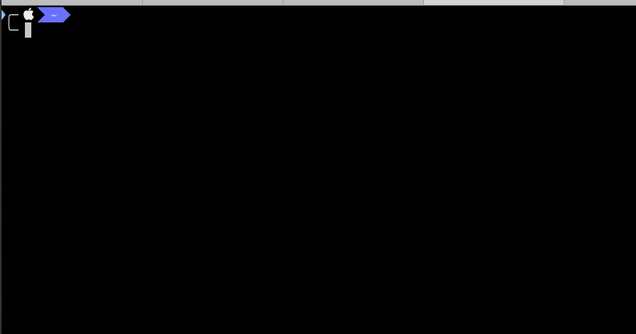

lsas
====

[](https://godoc.org/github.com/budougumi0617/lsas)
[](https://circleci.com/gh/budougumi0617/lsas/tree/master)
[](https://golangci.com/r/github.com/budougumi0617/lsas)
[](https://goreportcard.com/report/github.com/budougumi0617/lsas)

## Description
List view of aws autoscaling group.

## Demo & VS.
We use the AWS Console (web view) to display the information of the Auto Scaling Group (ASG). Also, we want to filter ASG search results using tags.
However, it is bothersome to do that with the `aws` command.
The `lsas` command displays ASG information similar to the AWS Console. The `lsas` command also has a filter function.



## Requirement
The lsas CLI needs the AWS Access Key ID, and the AWS Secret Access Key to access the autoscaling group information.
If you are able to access AWS information by AWS CLI, the lsas CLI is able to access AWS information same as AWS CLI.

- Configuring the AWS CLI
  - https://docs.aws.amazon.com/cli/latest/userguide/cli-chap-getting-started.html


## Usage

```
lsas -h
Usage of lsas:
  -p	print result header
  -print
    	print result header
  -i
    	Perform case insensitive matching.  By default, grep is case sensitive.
  --ignore-case
    	Perform case insensitive matching.  By default, grep is case sensitive.
  -r string
    	AWS region
  -region string
    	AWS region
```

## Install
You can download binary from [release page](https://github.com/budougumi0617/lsas/releases) and place it in $PATH directory.

### MacOS
If you want to install on MacOS, you can use Homebrew.
```
brew tap budougumi0617/lsas
brew install budougumi0617/lsas/lsas
```


## Contribution
1. Fork ([https://github.com/budougumi0617/lsas/fork](https://github.com/budougumi0617/lsas/fork))
2. Create a feature branch
3. Commit your changes
4. Rebase your local changes against the master branch
5. Run test suite with the `go test ./...` command and confirm that it passes
6. Run `gofmt -s`
7. Create new Pull Request

## License

[MIT](https://github.com/budougumi0617/lsas/blob/master/LICENSE)

## Author

[Yoichiro Shimizu](https://github.com/budougumi0617)

